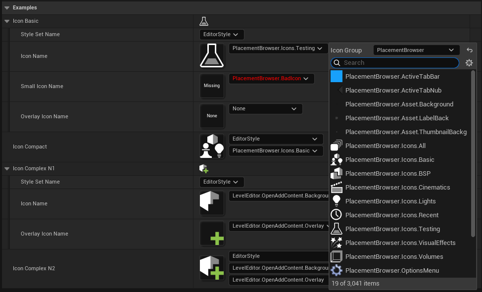

# SlateIconReferencePlugin

Plugin that provides picker of Slate Icons for Developer Settings




## Examples

```c++
UCLASS(MinimalAPI, DefaultConfig)
class USlateIconRefExample : public UDeveloperSettings
{
	GENERATED_BODY()
public:
	// Expose icon selector with default settings
	UPROPERTY(EditAnywhere, Config, Category="Examples")
	FSlateIconReference IconBasic;
	
	// Expose compact icon selector with default settings
	UPROPERTY(EditAnywhere, config, Category="Examples", meta=(DisplayMode=Compact))
	FSlateIconReference IconCompact;
	
	// Expose icon selector with customized settings (Standard display without Small Icon selector)
	UPROPERTY(EditAnywhere, config, Category="Examples", meta=(DisplayMode="Default,NoSmall"))
	FSlateIconReference IconComplexN1;
	
	// Expose icon selector with customized settings (Compact display with Icon and Overlay selector)
	UPROPERTY(EditAnywhere, config, Category="Examples", meta=(DisplayMode="Compact,WithIcon,WithOverlay"))
	FSlateIconReference IconComplexN2;
};
```

More examples can be found at `SlateIconRefExample.h`

## Supported Engine Versions

Compiles with Unreal Engine 4.27, 5.3-5.5, should work in newer engines without additional changes.

## Contributing

Please report any issues with GitHub Issues page for this repository.

If you want to suggest changes, improvements or updates to the plugin open an enhancement request issue.

## License

SlateIconReferencePlugin is available under the MIT license. See the LICENSE file for more info.

